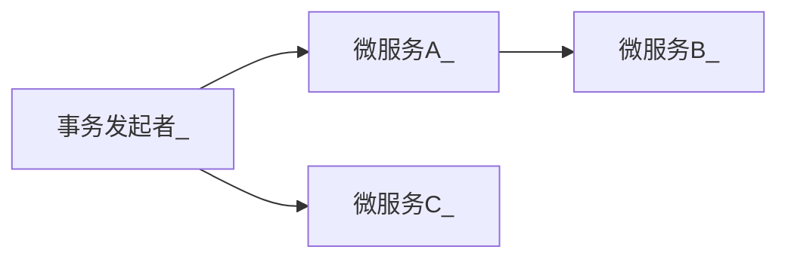
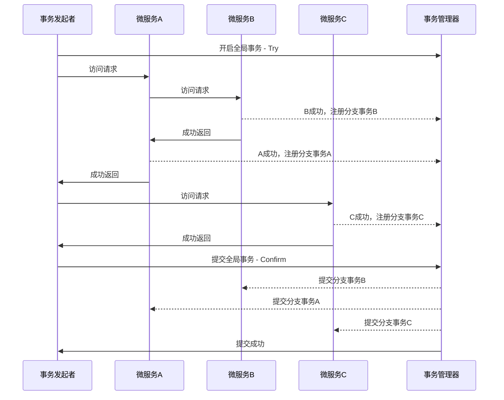

# 分布式事务

---

从版本2.3.0开始，UBSI的Container服务容器就能够支持微服务接口的"事务"注解，配合UBSI的事务管理器，UBSI为微服务的开发提供了高性能和简单易用的分布式事务方案。


> 分布式事务只在UBSI的正式版本提供，详见 https://ubsi-home.github.io/docs/transaction/readme.html


UBSI采用了TCC(Try-Confirm-Cancel)分布式事务模型，事务的处理流程与传统事务的两阶段提交协议(XA)类似，只不过需要一个全局事务管理器进行协调，但不限制每个分支节点如何实现自己的本地事务（分支事务）。

例如一个简单的服务访问场景：



在这个场景中，服务A/B/C都分别有自己的业务数据处理，如果开启了UBSI事务，其处理流程如下：




在UBSI的分布式事务方案中：

- 服务容器在声明了"事务"的接口处理成功完成后，自动在"事务管理器"注册一个"分支事务"；所有的事务动作结束后，"事务管理器"会自动会每个"分支事务"进行提交

- "事务管理器"是一个UBSI的标准微服务，支持多实例并行部署以保障可靠性

- 参与事务的微服务接口必须使用@USTxTry注解进行进行声明，并需要提供用@USTxConfirm/@USTxCancel声明的用于处理提交动作（包括commit/rollback）的接口，这两个接口不需要使用@USEntry声明为对外服务接口，UBSI容器会自动处理分支事务commit/rollback动作的调度

- 独立的Consumer客户端如果要开启事务需要使用rewin.ubsi.consumer.Transaction，示例代码如下：

  ```java
  // 开启一个新的全局事务
  try (Transaction tx = Transaction.start("全局事务分组", "事务名称", 10)) {
      // 构造一个事务场景下的服务请求
      Context context = tx.request("demo.tx", "buy", "apple", 1);
      context.call();
      tx.commit();	// 事务提交
  }
  // 如果失败，tx会自动进行事务回滚
  ```

  > 在微服务中开启全局事务，只需要正确声明@USTxTry注解即可，不需要直接使用Transaction对象。